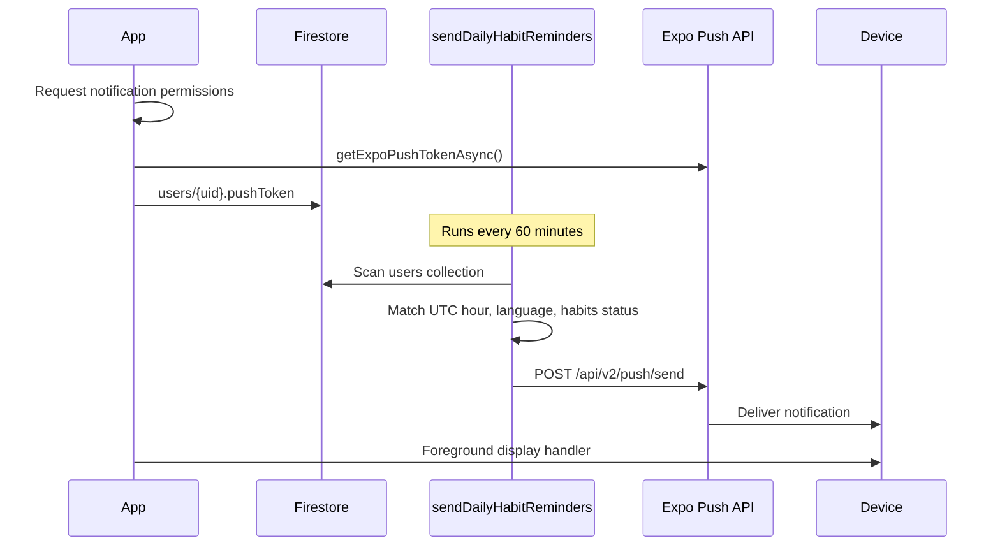

# Push notifications

EM Fit uses **Expo Push Notifications** on the client and a **Firebase scheduled Cloud Function** on the backend to send at most one daily habit reminder per user.

## Architecture

## Client

| File | Role |
|------|------|
| `src/services/notifications.ts` | Permissions, Expo token registration, foreground handler, tap-to-open Home |
| `src/context/AuthContext.tsx` | Auto-registers push token on sign-in when reminders are enabled |
| `src/screens/SettingsScreen.tsx` | Toggle reminders, UTC reminder hour, clears token when disabled |

### Registration flow

1. User signs in (or enables **Push reminders** in Settings).
2. App requests OS notification permission.
3. App calls `Notifications.getExpoPushTokenAsync()` (requires EAS project ID in `app.json`).
4. Token is saved to `users/{uid}.pushToken` in Firestore.

### Tap handling

Tapping a notification navigates to **Home** via `setupNotificationResponseHandler()` wired in `App.tsx`.

## Backend

| File | Role |
|------|------|
| `firebase/functions/src/index.ts` | `sendDailyHabitReminders` scheduled function |

### Scheduler logic

- Runs **every 60 minutes** (`onSchedule`).
- Paginates all `users` documents (300 per page).
- Skips users without `pushToken`.
- Skips if `settings.notificationsEnabled === false`.
- Sends only when current **UTC hour** matches `settings.reminderHourUtc` (default **13 UTC**).
- Skips if today's habit checklist is already complete (protein, water, workout, mood).
- Sends localized title/body based on `settings.language` (`en` or `es`).
- Clears invalid tokens on `DeviceNotRegistered` / `InvalidCredentials`.

### Reminder copy

| Language | Body |
|----------|------|
| English | Quick check-in: log protein, water, or start a workout. |
| Spanish | Registro rápido: anota proteína, agua o empieza un entrenamiento. |

## Configuration

- **`app.json`** — `expo-notifications` plugin and EAS `projectId`
- **`eas.json`** — no push-specific overrides; production uses real Firebase data
- **Deploy functions:** `npm run firebase:deploy` (or `firebase deploy --only functions`)

## What is not implemented

These are **in-app only** today (no push triggers):

- Missed-workout alerts
- Low-protein / macro-deficit alerts
- Weight milestones or streak notifications
- Inactivity nudges

Progress tracking appears on Home, History, and nutrition screens — not via push.

## Testing

1. Enable **Push reminders** in Settings on a **physical device** (simulators are unreliable for APNs).
2. Confirm `pushToken` is written to Firestore.
3. Set a UTC reminder hour matching the next scheduler run, or wait for the hourly job.
4. Verify localized body when `settings.language` is `es`.
5. Complete all four daily habits and confirm no reminder is sent that day.

See also `docs/PRODUCTION_CHECKLIST.md` for deploy and monitoring steps.
